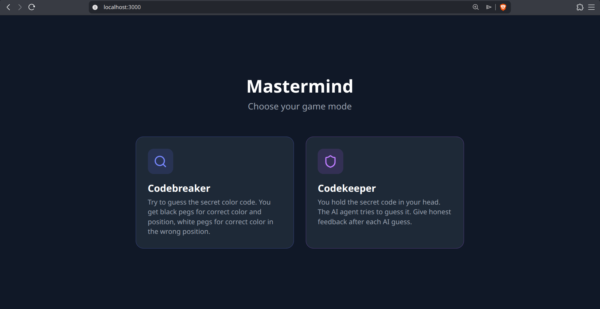
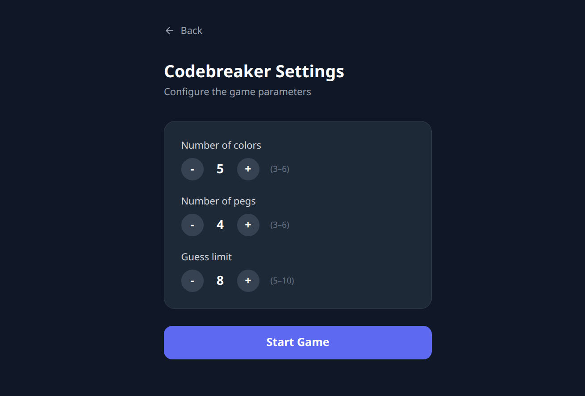
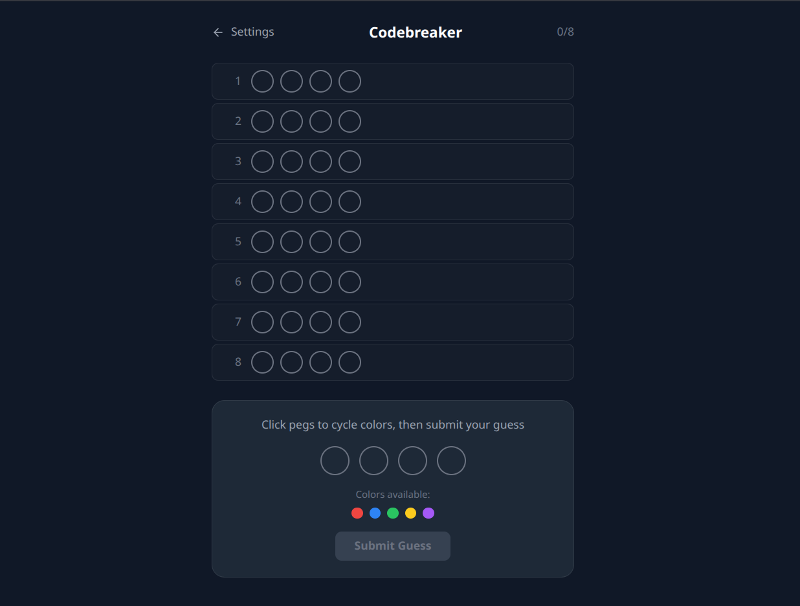
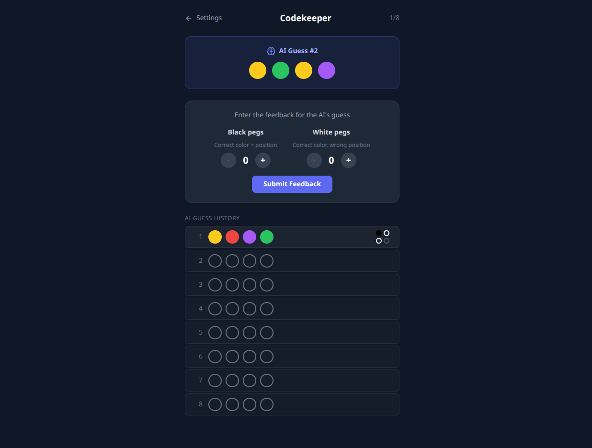

# MastermindAI

<p align="center">
  A reinforcement learning agent that plays Mastermind — challenge it in your browser!
</p>

<p align="center">
  
  
  
  
  
  
</p>

<p align="center">
  
</p>

---

## What is this?

Mastermind is a code-breaking board game. A secret 4-peg code is chosen from 6 colors. Each guess returns:

- **Black peg** — correct color in the correct position
- **White peg** — correct color in the wrong position

The objective is to crack the code in as few guesses as possible.

MastermindAI trains a reinforcement learning agent (MaskablePPO) to solve the game, achieving an average of ~4.3–4.5 guesses — beating rule-based strategies. The full-stack web app lets you play against the AI in two modes.

## Run

```bash
make web-run   # as easy as this

```

_open at http://localhost:3000_

## Agent Benchmarks

| Agent           | Avg Guesses  | Win Rate | Notes                  |
| --------------- | ------------ | -------- | ---------------------- |
| RandomAgent     | ~7–8         | low      | Floor — no constraints |
| ConsistentAgent | ~5–6         | medium   | Respects feedback      |
| KnuthAgent      | ≤5 (worst)   | 100%     | Minimax ceiling        |
| **RL Agent**    | **~4.3–4.5** | **~99%** | Target after training  |

## Play

<p align="center">
  
</p>

Before starting, configure the game: number of colors, pegs, and maximum guesses allowed.

---

### Codebreaker Mode

<p align="center">
  
</p>

The AI holds a secret code — you guess it. Enter a color combination, receive black/white peg feedback, and keep narrowing it down until you crack the code or run out of attempts.

---

### Codekeeper Mode

<p align="center">
  
</p>

You hold the secret code in your head — never typed in. The AI agent makes guesses and you provide honest black/white feedback after each one. Watch the AI systematically eliminate possibilities and deduce your code.
